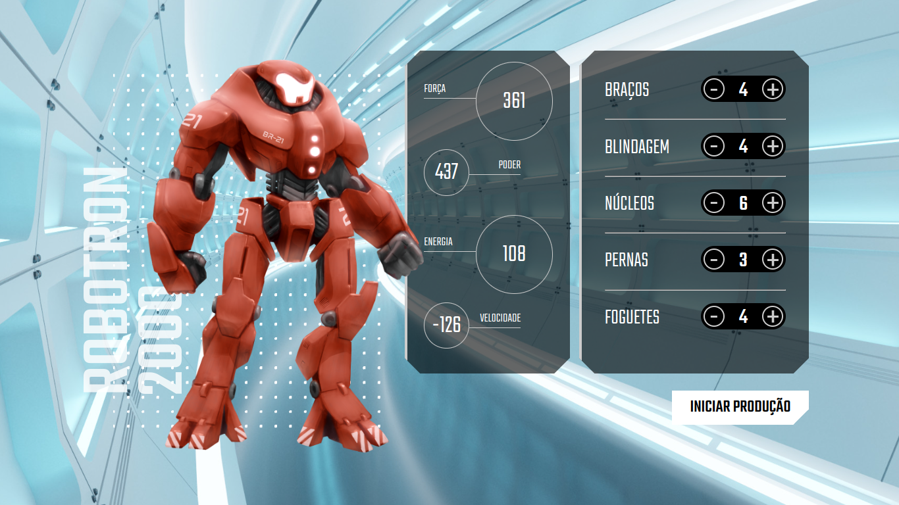

# <h1 align="center">Robotron-2000</h1>

<h2 align="center"><a href="https://robotron2000-hazel.vercel.app/">Clique para visitar o projeto</a></h2>

> Aliens vão invadir a terra! Precisamos montar robôs para que eles salvem a humanidade!

### O que aprendi ao fazer o projeto: 

- [x] Entender a interação do JavaScript com HTML e CSS.
- [x] Utilizar o JavaScript em uma página real
- [x] Aprender a tornar uma página dinâmica
- [x] Manipular dados, eventos e elementos com JavaScript
- [x] Entender como o JavaScript trabalha
- [x] Construir robôs para salvar o planeta Terra de uma invasão alienígena
- [x] Explorar, criar e declarar funções no JavaScript

[⬆ Voltar ao topo](#Robotron-2000) 
